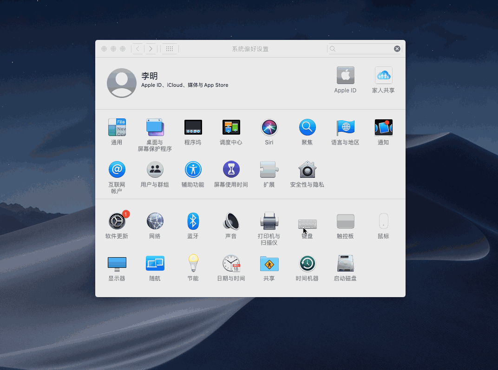
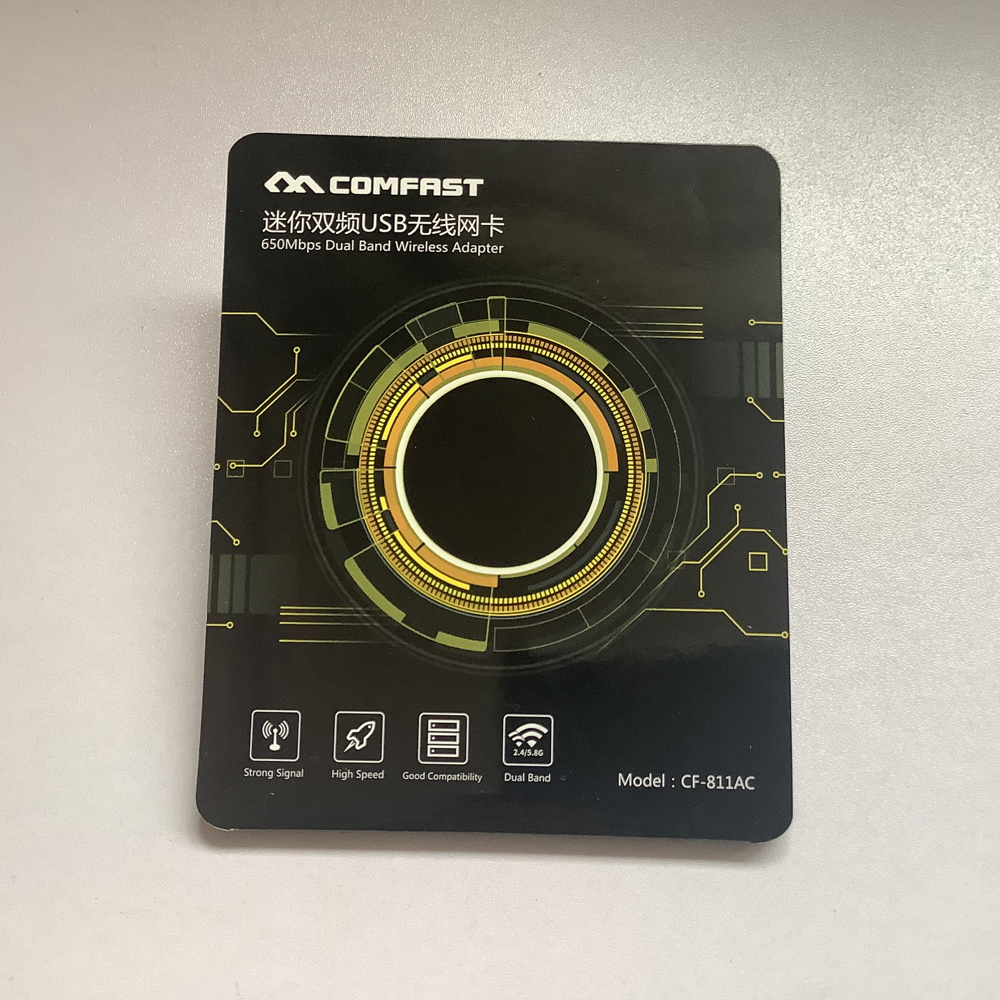

## 修改键盘映射

## USB无线网卡　

> 要使用 Airdop 只能更换内置无线网卡（好像是因为Wi-Fi和蓝牙必须一体才行），USB 无线网卡目前只有使用 WIFI 的功能   
> 我是买完到货以后尝试才知道的，心情有点失落

京东链接：https://item.jd.com/100004852332.html

驱动下载：https://github.com/chris1111/Wireless-USB-Adapter-Clover/releases
